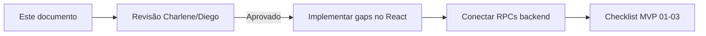
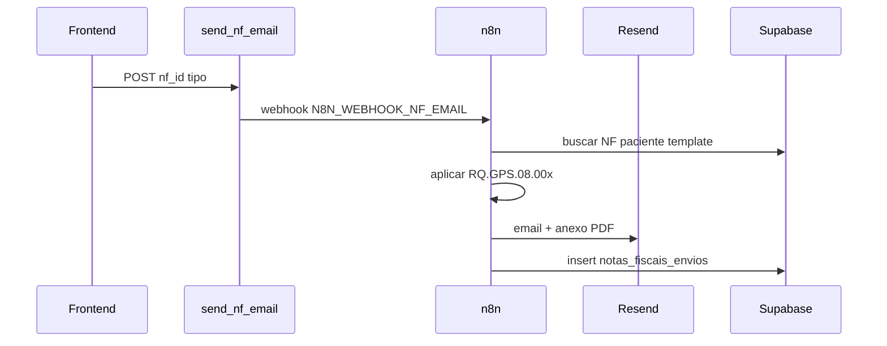

# Protótipo de Conteúdo — MVP Financeiro CB MOVE

**Versão:** 1.1 · 07/07/2026  
**Objetivo:** especificar o conteúdo de cada aba do financeiro para validação com Charlene/Diego **antes** de conectar RPCs e integrações finais.  
**Escopo:** Cobranças · Notas Fiscais · Relatórios · **Integrações**

---

## Referências

| Recurso | Caminho |
|---------|---------|
| Mockup visual (fonte de layout) | [`docs/mockup_design_system_cbmove.html`](mockup_design_system_cbmove.html) |
| Regras fiscais e cobrança | [`docs/regras_fiscais.md`](regras_fiscais.md) |
| Mapeamento importação | [`docs/import_financeiro_mapping.md`](import_financeiro_mapping.md) |
| Código React (shell existente) | `src/routes/app.cobrancas.tsx`, `app.notas-fiscais.tsx`, `app.relatorios.tsx`, `app.configuracoes.integracoes.tsx` |
| Workflow n8n (e-mail NF) | Plano backend · seção 6.1 · artefato `docs/n8n/workflow_nf_email.json` |
| Dados reais Supabase (Jun/2026) | 82 cobranças · R$ 305.983,69 total · 0 NFs · 118 pacientes |

> **Nota:** as rotas React já existem. Este documento define **o que cada aba deve mostrar**, não um HTML paralelo.

---

## 1. Visão geral

### 1.1 Problema

| Aba | Shell (UI) | Conteúdo hoje |
|-----|------------|---------------|
| Cobranças | ~95% | Dados reais (279 cobranças), mas falta painel inline de conciliação do mockup |
| Notas Fiscais | ~85% | **Vazia** — 0 registros; faltam fluxos manual e "A emitir" |
| Relatórios | ~60% | **Diverge do mockup** — sem KPIs por tipo; tabela em formato matriz 12 meses |

### 1.2 Atores

- **Gestão** (Charlene, Léo): valida KPIs, relatórios, conciliação
- **Recepção** (Rise, Vitória): cria cobranças, registra pagamentos
- **Diego**: confirma regras fiscais (judicial, PUC, convênio)

### 1.3 Fluxo de validação



---

## 2. Aba Cobranças

**Rota:** `/app/cobrancas` · **Arquivo:** `src/routes/app.cobrancas.tsx`  
**Referência mockup:** seção `cobrancas` em `mockup_design_system_cbmove.html`

### 2.1 Estrutura de blocos

```
┌─────────────────────────────────────────────────────────────┐
│ Header: "Cobranças" + [Extrato Bradesco] [+ Nova cobrança]  │
├─────────────────────────────────────────────────────────────┤
│ KPIs (4 cards): Total · Pago · Pendente · Vencido           │
│   → sempre do mês corrente, independente dos filtros          │
├─────────────────────────────────────────────────────────────┤
│ Toolbar: busca · competência · status · forma pgto · limpar │
├─────────────────────────────────────────────────────────────┤
│ Tabela principal (lista filtrada)                           │
├─────────────────────────────────────────────────────────────┤
│ [NOVO] Painel conciliação inline — últimos matches          │
└─────────────────────────────────────────────────────────────┘
```

### 2.2 KPIs (mês corrente)

| Card | Valor exemplo Jun/2026 | Cálculo | Contagem auxiliar |
|------|------------------------|---------|-------------------|
| Total do mês | R$ 305.983,69 | Σ valor onde competência = mês/ano | 82 cobranças |
| Pago | R$ 198.420,00 | Σ onde status = `pago` | 54 cobranças |
| Pendente | R$ 89.340,00 | Σ onde status ∈ `pendente`, `aguardando_convenio`, `aguardando_alvara` | 21 cobranças |
| Vencido | R$ 18.224,00 | Σ onde status ∈ `vencido`, `atrasado` | 7 cobranças |

**Regra:** KPIs não mudam quando o usuário filtra a tabela — apenas a lista abaixo muda.

### 2.3 Toolbar — filtros

| Filtro | Tipo | Opções |
|--------|------|--------|
| Busca | texto | Paciente, processo judicial |
| Competência | select | Últimos 12 meses (ex: Jun/2026) |
| Status | select | pendente, pago, vencido, atrasado, aguardando_convenio, aguardando_alvara, regularizar_retroativa, cancelado |
| Forma pgto | select | boleto, deposito, transferencia, alvara_judicial, convenio_direto |

### 2.4 Tabela — colunas

| Coluna | Campo DB | Exemplo |
|--------|----------|---------|
| Paciente | `pacientes.nome` + subtexto processo se judicial | **Susana Vaz** · Proc. 5004821 |
| Tipo | `cobrancas.tipo` | badge Judicial / Unimed / Particular / PUC |
| Competência | `competencia_mes` + `competencia_ano` | Jun/2026 |
| Forma pgto | `forma_pagamento` | Depósito, Boleto, Convênio direto |
| Vencimento | `vencimento` | 05/07/2026 |
| Status | `status` | Aguard. alvará, Pago, Vencido, Pendente |
| Valor | `valor` | R$ 2.128,00 |
| Ações | menu ⋯ | ver 2.5 |

### 2.5 Menu ⋯ — ações por linha

| Ação | Condição | Comportamento |
|------|----------|---------------|
| Marcar como pago | status ≠ pago | Abre modal com data de pagamento → `status = pago`, `pago_em = data` |
| Emitir boleto Cora | `forma_pagamento = boleto` | Chama `emit-boleto-cora` → exibe link/PDF ou fallback manual se 501 |
| Cancelar cobrança | status ≠ cancelado | `status = cancelado` com confirmação |

### 2.6 Modal — Nova cobrança

| Campo | Obrigatório | Default / regra |
|-------|-------------|-----------------|
| Paciente | sim | lista ativos; ao selecionar, preenche tipo e regime |
| Competência (mês/ano) | sim | mês corrente |
| Tipo | sim | herda do paciente; editável |
| Regime | sim | mensalista / por_sessao |
| Serviço | sim | ex: "Fisioterapia neurofuncional · 8 sessões" |
| Valor | sim | positivo; sugerir `valor_mensal` ou sessões × R$ 266 |
| Forma de pagamento | sim | conforme tipo (judicial → alvará; convênio → convenio_direto) |
| Vencimento | sim | inferir dia 5/10/15/25 da situação ou padrão dia 15 |
| Status | sim | default `pendente` |
| Observações | não | texto livre |

### 2.7 Modal — Extrato Bradesco (conciliação)

| Etapa | Conteúdo |
|-------|----------|
| 1. Upload | Aceita `.csv` ou `.ofx` do Bradesco |
| 2. Parser | `extrato-parser.ts` — extrai créditos |
| 3. Match | Valor ± R$ 0,01 · data ± 5 dias úteis do vencimento |
| 4. Lista | Checkbox por match: paciente, valor, % confiança |
| 5. Aplicar | Marca selecionados como `pago` em lote |

### 2.8 Painel conciliação inline (GAP — adicionar)

Bloco abaixo da tabela, visível quando há matches recentes ou após upload:

| Elemento | Exemplo |
|----------|---------|
| Título | Conciliação Bradesco · extrato CSV/OFX |
| Match 1 | Arturo Tavares · Jun/2026 · R$ 1.480,00 · ✓ Match 98% |
| Match 2 | Marina Stefano · Jun/2026 · R$ 720,00 · ✓ Match 100% |
| Match 3 | Paulo R. Júnior · Jun/2026 · R$ 980,00 · ⚠ Revisar data |

**Fonte:** últimos matches do modal extrato ou query `conciliacao_matches_recentes`.

### 2.9 Dados de exemplo (tabela)

| Paciente | Tipo | Comp. | Forma | Venc. | Status | Valor |
|----------|------|-------|-------|-------|--------|-------|
| Susana Vaz | Judicial | Jun/26 | Depósito | 05/07 | Aguard. alvará | R$ 2.128,00 |
| Arturo Tavares | Convênio (Unimed) | Jun/26 | Convênio direto | 10/07 | Pago | R$ 1.480,00 |
| Amanda Avancini | Judicial | Mai/26 | Boleto | 28/06 | Vencido | R$ 3.192,00 |
| Paulo R. Júnior | Particular | Jun/26 | Boleto | 15/07 | Pendente | R$ 980,00 |
| Marina Stefano | PUC | Jun/26 | Convênio direto | 20/07 | Pago | R$ 720,00 |
| Roberto Senna | Judicial | Mai/26 | Depósito | 30/06 | Aguard. convênio | R$ 1.862,00 |

---

## 3. Aba Notas Fiscais

**Rota:** `/app/notas-fiscais` · **Arquivo:** `src/routes/app.notas-fiscais.tsx`  
**Referência mockup:** seção `nfs` em `mockup_design_system_cbmove.html`

### 3.1 Estrutura de blocos

```
┌─────────────────────────────────────────────────────────────┐
│ Header: "Notas Fiscais" + [Importar PDF] [+ Emitir NF]      │
├─────────────────────────────────────────────────────────────┤
│ Toolbar: busca · status · competência · tipo · limpar       │
├─────────────────────────────────────────────────────────────┤
│ Tabela: NFs emitidas + linhas "A emitir" (cobrança sem NF)  │
└─────────────────────────────────────────────────────────────┘
```

### 3.2 Regras de destinatário por tipo

Fonte: [`regras_fiscais.md`](regras_fiscais.md)

| Tipo paciente | Tomador da NF (destinatário) | Documento | Corpo / discriminação | Template |
|---------------|------------------------------|-----------|----------------------|----------|
| Particular | Nome do paciente | CPF | Serviço prestado + sessões | RQ.GPS.07.001 |
| Convênio | Nome do convênio (Unimed, etc.) | CNPJ do convênio | Nota direta em nome do convênio | RQ.GPS.07.002 |
| Judicial — Bradesco | Bradesco Seguros | CNPJ | Paciente + CPF + processo + sessões | RQ.GPS.07.003 |
| Judicial — CCG/Unimed | Convênio ou seguradora | CNPJ | Paciente + processo no corpo | ⚠ Confirmar com Diego |
| PUC | PUCRS | CNPJ PUCRS | ⚠ Confirmar template | ⚠ Confirmar com Diego |

### 3.3 Toolbar — filtros

| Filtro | Opções |
|--------|--------|
| Busca | Número NF, paciente, destinatário |
| Status | pendente, emitida, cancelada, erro, regularizada_retroativa, **a_emitir** (novo) |
| Competência | Últimos 12 meses |
| Tipo | particular, convenio, judicial, puc |

### 3.4 Tabela — colunas

| Coluna | Campo | Exibição especial |
|--------|-------|-------------------|
| Nº | `numero` | `NF-001284` ou `—` se pendente |
| Paciente | `pacientes.nome` | — |
| Destinatário | `destinatario_nome` + `destinatario_documento` | Judicial: subtexto "Corpo: paciente + proc. XXXXX" |
| Tipo | `tipo` | badge colorido |
| Emissão | `emissao` | dd/mm/aaaa ou `—` |
| Status | `status` | badge: Emitida, A emitir, Pendente, Cancelada |
| Valor | `valor` | R$ formatado |
| Ações | menu ⋯ | ver 3.6 |

### 3.5 Linhas "A emitir" (GAP — adicionar)

Cobranças do mês com status elegível (`pago`, `pendente`, `aguardando_*`) **sem** NF vinculada (`cobranca_id` null em `notas_fiscais`):

| Paciente | Destinatário sugerido | Status | Ação rápida |
|----------|----------------------|--------|------------|
| Amanda Avancini | Unimed (judicial no corpo) | A emitir | [Emitir] → abre modal pré-preenchido |

**Fonte:** RPC `cobrancas_sem_nf(mes, ano)` ou view `vw_cobrancas_pendentes_nf`.

### 3.6 Menu ⋯ — ações

| Ação | Condição |
|------|----------|
| Ver PDF | `pdf_url` preenchido → abre Storage |
| Reenviar por e-mail | status = emitida → `send-nf-email` → **webhook n8n** → Resend |
| Registrar emissão manual | status = pendente → informar número + upload PDF |
| Cancelar NF | status = emitida → motivo + `status = cancelada` |
| Vincular cobrança | se `cobranca_id` null |

### 3.7 Modal — Emitir NF

| Campo | Obrigatório | Comportamento |
|-------|-------------|---------------|
| Cobrança vinculada | recomendado | select cobranças do paciente/competência; preenche valor |
| Paciente | sim | auto tipo e campos judiciais |
| Competência | sim | mês/ano |
| Valor | sim | da cobrança ou calculado |
| Destinatário — Nome | sim | auto via `resolver_destinatario_nf` |
| Destinatário — CPF/CNPJ | sim | CPF paciente ou CNPJ convênio |
| Corpo judicial | se tipo = judicial | nome, CPF, processo, total sessões |
| Modo de emissão | sim | **Manual** (número + PDF) ou **Automático** (Nuvem Fiscal pós-homologação) |
| Número NF | se manual | texto |
| Data emissão | sim | default hoje |
| Upload PDF | se manual | Storage `notas-fiscais/nf/{ano}/{numero}.pdf` |

**Fluxo manual (MVP amanhã):**
1. Gestão emite no portal (Safe Notas ou provedor escolhido)
2. Registra número + PDF no CB MOVE
3. Status → `emitida`

**Fluxo automático (pós-spike POA):**
1. `emit-nf` edge function → adapter fiscal
2. Webhook atualiza status + PDF
3. `send-nf-email` dispara workflow **n8n** → template RQ.GPS.08.xxx → Resend → log em `notas_fiscais_envios` (ver §3.10)

### 3.8 Modal — Importar PDF (GAP — adicionar)

Para NFs já emitidas fora do sistema:

| Campo | Descrição |
|-------|-----------|
| Arquivo PDF | upload |
| Número NF | texto |
| Paciente | select |
| Valor | número |
| Data emissão | date |
| Destinatário | nome + doc |

### 3.9 Dados de exemplo (tabela)

| Nº | Paciente | Destinatário | Tipo | Emissão | Status | Valor |
|----|----------|--------------|------|---------|--------|-------|
| NF-001284 | Susana Vaz | Bradesco Seguros · corpo: paciente + proc. 5004821 | Judicial | 15/06/26 | Emitida | R$ 2.128,00 |
| NF-001283 | Arturo Tavares | Unimed · CNPJ 12.345.678/0001-90 | Convênio | 14/06/26 | Emitida | R$ 1.480,00 |
| NF-001282 | Paulo R. Júnior | Paulo R. Júnior · CPF 245.***.***-78 | Particular | 10/06/26 | Emitida | R$ 980,00 |
| — | Amanda Avancini | Unimed · judicial no corpo | Judicial | — | **A emitir** | R$ 3.192,00 |
| NF-001280 | Roberto Senna | Centro Clínico Gaúcho | Judicial | 05/06/26 | Cancelada | R$ 1.862,00 |

### 3.10 Fluxo de e-mail pós-emissão (n8n)

Disparado automaticamente após NF `emitida` (automático ou manual com PDF):



| Tipo NF | Template e-mail | Destinatário | CC |
|---------|-----------------|--------------|-----|
| Particular | RQ.GPS.08.001 | `pacientes.email` | — |
| Convênio | RQ.GPS.08.002 | `convenios.email_nf` | — |
| Judicial | RQ.GPS.08.003 | seguradora/convênio | `advogado_email` se houver |

**Edge `send-nf-email`:** apenas dispatcher (não chama Resend direto). Retorna `{ ok: true, queued: true }`.

---

## 4. Aba Relatórios

**Rota:** `/app/relatorios` · **Arquivo:** `src/routes/app.relatorios.tsx`  
**Referência mockup:** seção `relatorios` em `mockup_design_system_cbmove.html`  
**Decisão:** realinhar ao mockup (KPIs por tipo + tabela convênio mensal), mantendo sub-aba IR.

### 4.1 Estrutura de blocos (nova — alinhada ao mockup)

```
┌─────────────────────────────────────────────────────────────┐
│ Header: "Relatórios consolidados" + [PDF] [CSV]             │
├─────────────────────────────────────────────────────────────┤
│ KPIs por tipo (4): Particular · Judicial · Convênio · PUC     │
│   valor + quantidade de pacientes                           │
├─────────────────────────────────────────────────────────────┤
│ Filtro: competência (ex: Jun/2026)                          │
├─────────────────────────────────────────────────────────────┤
│ Tabela: Receita por convênio                                │
│   convênio · pacientes · sessões · NFs · faturado · recebido│
├─────────────────────────────────────────────────────────────┤
│ Tabs secundárias:                                           │
│   [Receita por convênio]  [NFs por paciente — IR]           │
└─────────────────────────────────────────────────────────────┘
```

### 4.2 KPIs por tipo (GAP — adicionar)

Filtro: competência selecionada (default mês corrente).

| KPI | Valor exemplo Jun/2026 | Pacientes | Cor |
|-----|------------------------|-----------|-----|
| Particular | R$ 89.420,00 | 38 | cyan |
| Judicial | R$ 142.180,00 | 42 | magenta |
| Convênio | R$ 58.860,00 | 28 | purple |
| PUC | R$ 15.524,00 | 10 | orange |

**Fonte:** RPC `financeiro_kpis_por_tipo(mes, ano)` — agrega `cobrancas` por `tipo`.

### 4.3 Tabela — Receita por convênio (substituir matriz 12 meses na aba principal)

| Coluna | Definição | Fonte |
|--------|-----------|-------|
| Convênio | Nome do convênio ou tipo se sem convênio | `convenios.nome` ou `cobrancas.tipo` |
| Pacientes | COUNT DISTINCT pacientes no mês | `cobrancas` + `pacientes` |
| Sessões | Total sessões cobráveis no mês | `sessoes` (quando alimentado) ou estimativa por cobrança |
| NFs emitidas | COUNT NFs emitidas no mês | `notas_fiscais` status = emitida |
| Faturado | Σ valor cobranças do mês (todos status exceto cancelado) | `cobrancas.valor` |
| Recebido | Σ valor cobranças `status = pago` | `cobrancas.valor` |

**Fonte:** RPC `relatorio_receita_convenio(mes, ano)`.

### 4.4 Dados de exemplo (Jun/2026)

| Convênio | Pacientes | Sessões | NFs emitidas | Faturado | Recebido |
|----------|-----------|---------|--------------|----------|----------|
| Unimed | 14 | 168 | 14 | R$ 22.344,00 | R$ 18.420,00 |
| Bradesco Seguros | 8 | 96 | 8 | R$ 12.768,00 | R$ 9.840,00 |
| Centro Clínico Gaúcho | 6 | 72 | 5 | R$ 8.624,00 | R$ 5.920,00 |

### 4.5 Exportações (header)

| Botão | Formato | Conteúdo |
|-------|---------|----------|
| Exportar PDF | PDF | KPIs + tabela convênio do mês filtrado |
| Exportar CSV | CSV | Mesmas colunas da tabela |

### 4.6 Sub-aba — NFs por paciente (IR)

Manter implementação atual com melhorias:

| Elemento | Comportamento |
|----------|---------------|
| Filtros | Ano + select paciente |
| Cabeçalho | Nome, CPF, ano, total pago |
| Tabela | Nº NF, emissão, destinatário, status, valor |
| Exportar IR | `gerar-relatorio-ir` → PDF (hoje JSON stub) |

**Público:** pacientes particulares para declaração anual.

### 4.7 Dados de exemplo — IR

| Paciente | CPF | NFs no ano | Total pago |
|----------|-----|------------|------------|
| Paulo R. Júnior | 245.***.***-78 | 6 | R$ 5.880,00 |
| Lúcia Mendes | 312.***.***-44 | 5 | R$ 4.900,00 |
| João Vieira | 198.***.***-21 | 4 | R$ 3.920,00 |

---

## 5. Aba Integrações

**Rota:** `/app/configuracoes/integracoes` · **Arquivo:** `src/routes/app.configuracoes.integracoes.tsx`  
**Referência mockup:** seção `integ` em `mockup_design_system_cbmove.html`

### 5.1 Estrutura de blocos

```
┌─────────────────────────────────────────────────────────────┐
│ Header: "Integrações" + subtítulo                           │
├─────────────────────────────────────────────────────────────┤
│ Grid de cards (2–3 colunas)                                 │
│   Cora · Nuvem Fiscal · n8n · Resend · Bradesco             │
├─────────────────────────────────────────────────────────────┤
│ Rodapé: credenciais via env / suporte técnico               │
└─────────────────────────────────────────────────────────────┘
```

### 5.2 Cards de integração (MVP financeiro)

| Card | Categoria | Descrição | Status exemplo | Secrets / config |
|------|-----------|-----------|----------------|------------------|
| **Cora** | Financeiro | Emissão e gestão de boletos bancários | Aguardando credenciais | `CORA_CLIENT_ID`, `CORA_CLIENT_SECRET` |
| **Nuvem Fiscal** | Fiscal | NFS-e automática POA (substitui Safe Notas) | Spike em andamento | `NUVEMFISCAL_*` ou `FOCUSNFE_TOKEN` |
| **n8n** | Automação | Orquestra envio de e-mails de NF (templates por tipo) | Configurar workflow | `N8N_WEBHOOK_NF_EMAIL`, `N8N_WEBHOOK_SECRET` |
| **Resend** | Comunicação | Entrega SMTP dos e-mails (via n8n) | Aguardando API key | `RESEND_API_KEY` (no n8n) |
| **Bradesco** | Financeiro | Conciliação por import de extratos CSV/OFX | Ativo (parser client) | — |

**Remover do card fiscal:** Safe Notas (substituído por Nuvem Fiscal / Focus NFe no plano).

### 5.3 Card n8n — detalhe de conteúdo

| Elemento | Conteúdo no protótipo |
|----------|----------------------|
| Título | n8n |
| Subtítulo | Automação · E-mail NF |
| Descrição | Workflow dispara após emissão de NF: aplica template RQ.GPS.08 por tipo, anexa PDF e envia via Resend. |
| Badge status | `Configurar workflow` ou `Ativo` quando webhook testado |
| Botão | Configurar (disabled no MVP — credenciais no servidor) |
| Link técnico | `docs/n8n/workflow_nf_email.json` |

### 5.4 Fluxo visual sugerido no card n8n

```
NF emitida → send-nf-email → n8n → Resend → ✓ E-mail enviado
```

### 5.5 Gap vs. código React atual

| Item | Código hoje | Spec / protótipo |
|------|-------------|------------------|
| Cards | Cora, Safe Notas, Resend | Cora, **Nuvem Fiscal**, **n8n**, Resend, Bradesco |
| Safe Notas | Presente | **Remover** |
| n8n | Ausente | **Adicionar** |
| Nuvem Fiscal | Ausente | **Adicionar** |
| Bradesco | Ausente | **Adicionar** (conciliação) |

---

## 6. Gap analysis — código vs. spec

| Item | Cobranças | Notas Fiscais | Relatórios |
|------|-----------|---------------|------------|
| Header + ações | OK | Falta Importar PDF | Falta export PDF/CSV global |
| KPIs | OK | N/A | **Falta KPIs por tipo** |
| Toolbar filtros | OK | OK | Falta filtro competência (só ano) |
| Tabela principal | OK | OK (vazia sem dados) | **Formato errado** (matriz 12m) |
| Painel conciliação inline | **Falta** | N/A | N/A |
| Linhas "A emitir" | N/A | **Falta** | N/A |
| Modal emitir completo | N/A | Falta modo manual + upload | N/A |
| Sub-aba IR | N/A | N/A | OK (parcial) |
| RPC backend | Parcial | **Falta** resolver_destinatario | **Falta** kpis_por_tipo + receita_convenio |
| **Integrações** | Cards estáticos (Safe Notas) | **Falta** n8n, Nuvem Fiscal, Bradesco | Atualizar `app.configuracoes.integracoes.tsx` |

---

## 7. RPCs e fontes de dados necessárias

| RPC / View | Usado em | Retorno |
|------------|----------|---------|
| `financeiro_kpis(mes, ano)` | Dashboard, Cobranças | total, pago, pendente, vencido |
| `financeiro_kpis_por_tipo(mes, ano)` | Relatórios | 4 KPIs com valor e qtd pacientes |
| `relatorio_receita_convenio(mes, ano)` | Relatórios | tabela mockup (6 colunas) |
| `resolver_destinatario_nf(cobranca_id)` | Modal Emitir NF | nome, doc, corpo judicial |
| `cobrancas_sem_nf(mes, ano)` | Lista NF | cobranças sem NF vinculada |
| `atualizar_cobrancas_vencidas()` | Cron diário | job automático |
| Webhook n8n `nf_email` | `send-nf-email` → n8n | payload `{ nf_id, tipo, event }` |

---

## 8. Checklist de aceite (Charlene / Diego)

### Cobranças
- [ ] KPIs batem com planilha Jun/2026 (± tolerância importação)
- [ ] Status `aguardando_alvara` e `aguardando_convenio` corretos
- [ ] Conciliação Bradesco: match manual antes de marcar pago
- [ ] Boleto Cora: fallback manual aceitável até integração

### Notas Fiscais
- [ ] Destinatário correto para cada tipo (particular, convênio, judicial)
- [ ] Campos judiciais: processo + sessões no corpo
- [ ] Fluxo manual (número + PDF) funciona sem provedor automático
- [ ] E-mail NF dispara via n8n com template correto por tipo
- [ ] CC advogado em judicial quando `advogado_email` preenchido
- [ ] Diego confirma: PUC, CCG judicial, sessões RC no corpo

### Integrações
- [ ] Cards exibem Cora, Nuvem Fiscal, n8n, Resend, Bradesco (sem Safe Notas)
- [ ] Status de cada integração reflete estado real (credenciais / spike)
- [ ] Workflow n8n documentado em `docs/n8n/workflow_nf_email.json`

### Relatórios
- [ ] KPIs por tipo refletem realidade do mês
- [ ] Tabela convênio: faturado vs. recebido faz sentido operacional
- [ ] Coluna sessões: origem definida (frequência ou estimativa)
- [ ] Export IR atende declaração de pacientes particulares

### Geral
- [ ] Layout consistente com mockup CB MOVE (cores, badges, tipografia)
- [ ] Empty states orientam próxima ação (não tela em branco)
- [ ] Dados sensíveis mascarados em demo (CPF parcial)

---

## 9. Pendências para Diego

| # | Pergunta | Impacto |
|---|----------|---------|
| 1 | PUC usa template particular ou próprio? CNPJ PUCRS? | Modal Emitir NF |
| 2 | Judicial CCG/Unimed: template 07.002 ou 07.003? | Destinatário NF |
| 3 | Sessões recuperadas (RC) entram no corpo da NF? | Discriminação |
| 4 | Coluna "sessões" no relatório: vem da frequência ou estimativa? | Relatórios |
| 5 | Como identificar pagador pelo extrato Bradesco? | Conciliação |
| 6 | CNPJs oficiais: Unimed, Bradesco Seguros, CCG | Convênios + NF |
| 7 | Certificado A1 e credenciais provedor fiscal | Integração automática |

---

## 10. Ordem de implementação sugerida

| # | Tarefa | Depende de |
|---|--------|------------|
| 1 | Aprovar este documento com Charlene/Diego | — |
| 2 | Migration `financeiro_mvp.sql` + RPCs | Aprovação |
| 3 | Refatorar `app.relatorios.tsx` (KPIs + tabela mockup) | RPCs |
| 4 | Adicionar linhas "A emitir" + Importar PDF em NF | RPC resolver_destinatario |
| 5 | **Workflow n8n e-mail NF + refatorar send-nf-email** | Webhook URL |
| 6 | Atualizar tela Integrações (cards n8n, Nuvem Fiscal) | Aprovação spec |
| 7 | Painel conciliação inline em Cobranças | Parser (já existe) |
| 6 | Seed opcional: 5 NFs exemplo pós-aprovação | Ambiente dev |
| 7 | Conectar adapter fiscal (pós-spike POA) | Credenciais Diego |

---

## Anexo A — JSON de exemplo (cobrança)

```json
{
  "paciente": "Susana Vaz",
  "tipo": "judicial",
  "competencia": "2026-06",
  "forma_pagamento": "deposito",
  "vencimento": "2026-07-05",
  "status": "aguardando_alvara",
  "valor": 2128.00,
  "servico": "Fisioterapia neurofuncional · 8 sessões",
  "numero_processo": "5004821"
}
```

## Anexo B — JSON de exemplo (nota fiscal judicial)

```json
{
  "numero": "NF-001284",
  "paciente": "Susana Vaz",
  "tipo": "judicial",
  "destinatario_nome": "Bradesco Seguros",
  "destinatario_documento": "34.567.890/0001-12",
  "corpo_paciente_nome": "Susana Vaz",
  "corpo_paciente_cpf": "392.***.***-12",
  "corpo_numero_processo": "5004821",
  "corpo_total_sessoes": 8,
  "valor": 2128.00,
  "emissao": "2026-06-15",
  "status": "emitida"
}
```

## Anexo C — JSON de exemplo (relatório convênio)

```json
{
  "competencia": "2026-06",
  "kpis_por_tipo": {
    "particular": { "valor": 89420, "pacientes": 38 },
    "judicial": { "valor": 142180, "pacientes": 42 },
    "convenio": { "valor": 58860, "pacientes": 28 },
    "puc": { "valor": 15524, "pacientes": 10 }
  },
  "convenios": [
    { "nome": "Unimed", "pacientes": 14, "sessoes": 168, "nfs_emitidas": 14, "faturado": 22344, "recebido": 18420 },
    { "nome": "Bradesco Seguros", "pacientes": 8, "sessoes": 96, "nfs_emitidas": 8, "faturado": 12768, "recebido": 9840 },
    { "nome": "Centro Clínico Gaúcho", "pacientes": 6, "sessoes": 72, "nfs_emitidas": 5, "faturado": 8624, "recebido": 5920 }
  ]
}
```

---

*Documento gerado para validação do MVP Financeiro CB MOVE · Entregas 01–03 do Diagnóstico.*
